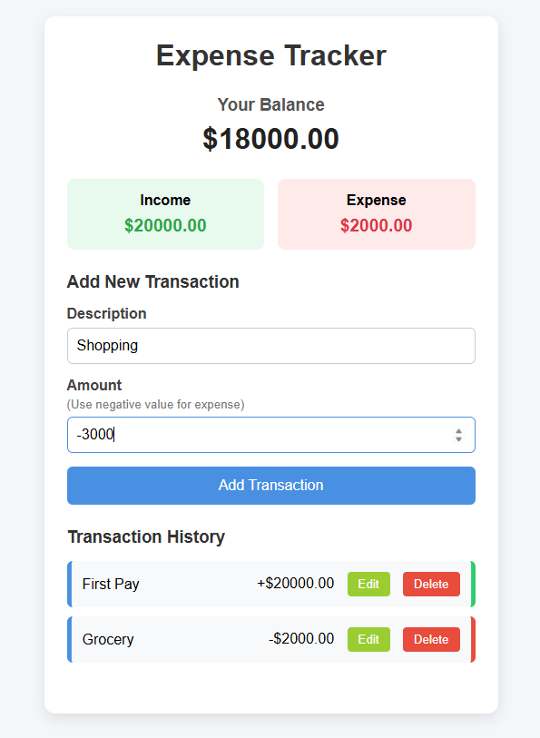

# Expense Tracker

A simple and responsive expense tracker application built with HTML, CSS, and Vanilla JavaScript. It allows users to track income, expenses, and balance dynamically.

## Features

- Add income and expense transactions
- Calculate current balance automatically
- Display total income and expenses
- Delete transactions
- Dynamic transaction list updates
- Income and expense styling
- Input validation
- Responsive design

## Technologies Used

- HTML
- CSS
- JavaScript

## Screenshot



## How to Run

1. Clone the repository

```bash
git clone https://github.com/Areej39/vanilla-js-expense-tracker
```

2. Open the project folder

```bash
cd vanilla-js-expense-tracker
```

3. Open `index.html` in your browser

## Project Structure

```
vanilla-js-expense-tracker/
│
├── index.html
├── style.css
├── script.js
└── screenshot.png
```
